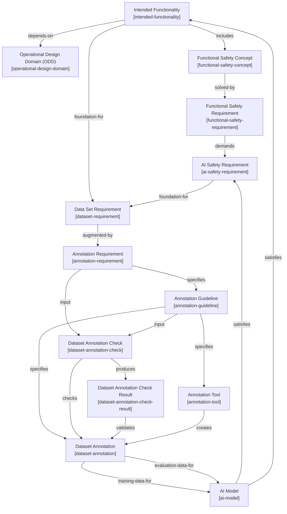
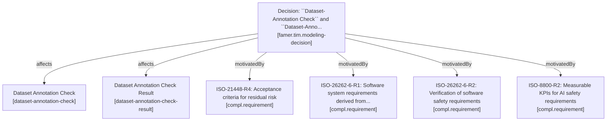

# Famer TIM

A Traceability Information Model (TIM) for AI-based perception systems in safety-critical automotive applications, developed as part of the [FAMER](https://ffi-famer.github.io/) project.

## Table of Contents

- [Description](#description)
- [Installation](#installation)
- [Usage](#usage)
- [Graphical Model](#graphical-model)
- [Repository Structure](#repository-structure)
- [Core Artifacts](#core-artifacts)
- [Ways of Working](#ways-of-working)
- [Authors and Acknowledgment](#authors-and-acknowledgment)
- [Project Status](#project-status)
- [License](#license)

## Description

FAMER TIM defines the artifact types and traceability links needed to demonstrate compliance with ISO safety standards when developing AI-based
perception systems. It connects functional safety concepts, AI safety requirements, dataset and annotation requirements, AI models, and validation results into a single traceable model.

The model is implemented using [Treqs](https://pypi.org/project/treqs-ng/), an open source command-line tool for managing textual requirements and traceability directly in Git-versioned Markdown files.


## Installation

Treqs is published on PyPI and requires Python 3.

```bash
pip install treqs-ng
```

Verify the installation:

```bash
treqs --help
```

It's recommended to install it inside a virtual environment:

```bash
python -m venv venv
source venv/bin/activate   # on Windows: venv\\Scripts\\activate
pip install treqs-ng
```

## Usage
Clone this repository and run the following commands from the project root.

**1. Check the model is valid (no broken links):**
```bash
treqs check
```

**2. List all elements of a given type**, e.g. all annotation requirements:
```bash
treqs list --type annotation-requirement
```

**3. Trace everything related to a specific element**, e.g. a compliance requirement:
```bash
treqs list --outlinks --uid d13a197ac7ce11f0ae0a467a017f3d7d
```

**4.Generate the graphical traceability model:**
```bash
treqs list --plantuml --outlinks tim-documentation/famer-tim-rationale.md
```

**5. Generate a standards-to-element overview**, e.g. for annotation requirements:
```bash
treqs list --plantuml --inlinks --followlinks True --type annotation-requirement
```

## Repository Structure

```bash
famer-tim/
├── example/                           # Concrete example artifacts 
├── method/
│   └── research-method.md             # Research method description
├── standards-treqs/                   # Compliance requirements derived from
│                                       # ISO standards, linked to TIM elements
├── templates/                         # Reusable templates for new TIM elements
├── tim-documentation/
│   ├── famer-tim-design-decisions.md  # Documented modeling decisions
│   └── famer-tim-rationale.md         # TIM elements, links, and design rationale
└── ttim.yaml                          # Type and trace information model schema
```


## Core Artifacts

| Type | Description |
|---|---|
| `operational-design-domain` | Operating conditions and boundaries |
| `intended-functionality` | High-level description of system behavior |
| `functional-safety-concept` | How safety goals are achieved at system level |
| `functional-safety-requirement` | Specific system-level safety requirements |
| `ai-safety-requirement` | Safety requirements for the AI component, including measurable KPIs |
| `dataset-requirement` | Definition of the input space needed for training/validation |
| `annotation-requirement` | Abstract specification of what must be labeled |
| `annotation-guideline` | Concrete labeling instructions and examples |
| `annotation-tool` | Tool used to produce annotations |
| `dataset-annotation` | Concrete labeled dataset |
| `ai-model` | Trained model instance, with architecture/version/configuration attributes |
| `dataset-annotation-check` | Test scenario used to validate annotation/model quality |
| `dataset-annotation-check-result` | Outcome of a check, including pass/fail status |

Full type definitions and allowed links are specified in [`ttim.yaml`](./ttim.yaml).
The following graph shows a visualization of the model derived from the file [famer-tim-rationale.md](tim-documentation/famer-tim-rationale.md).



## Ways of working

We highlighted clauses relevant to traceability across ISO/PAS 8800, ISO 21448, and ISO 26262-6, and derived requirements for the TIM from them.
These clauses are summarized in ``compl.requirements``, showing our commitment to align the TIM with them.
Beyond standards, we also derive ``compl.requirements`` from interaction with experts from industrial practice and research done in a joint research project.

Starting from a first draft of a TIM, we then iteratively improve it to align it with the (growing) set of ``compl.requirements``.
Each change has been documented as a ``famer.tim.modeling-decision``.
Each TIM modeling decision is traced back to the requirement(s) that motivated it and the TIM elements it affects; these decisions can be found in [famer-tim-design-decisions.md](tim-documentation/famer-tim-design-decisions.md).
For traceability, we rely on ``treqs`` explicit tracelinks (``treqs-link``) which are visible in the source view of markdown files. 
TReqs defines artifacts and tracelinks in its [metamodel](ttim.yaml) and enforces valid traceability via the CLI command ``treqs check``.

The following graph shows an example of the traceability from TIM artifacts over modeling decisions to compliance requirements:



## Authors and acknowledgment

Created by:

- Claudia Sevilla Eslava
- Hina Saeeda
- Eric Knauss

Supervisor: Eric Knauss

## Project Status

This is a research-in-progress model. Various elements and link directions are still under expert evaluation.

## License

Licensed with the [MIT License](https://opensource.org/licenses/MIT). 


