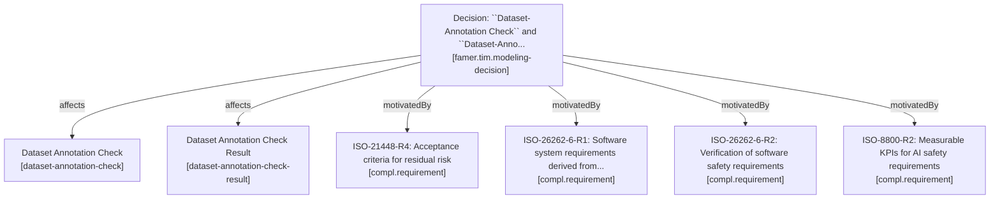

# FAMER TIM Design Decisions

This file explains TIM design decisions.
Each TIM design decision *affects* a primary TIM element (i.e. a traceable artifact) and links them to a motivating compliance requirement.

The ``treqs`` tool can be used to explore this traceability:

```bash
# List all TIM design decisions:
treqs list --type famer.tim.modeling-decision

# To explore the impact and motivation of an individual design decision, select
# its UID from the output of the previous command. Then insert it into the 
# following command:
treqs list --outlinks --uid b44158eee5584f63818c1a70f869f879

# The output can be provided as a graphical model, using plantuml:
treqs list --outlinks --plantuml --uid b44158eee5584f63818c1a70f869f879 

# Finally, treqs can follow links recursively, showing all dependent links:
treqs list --outlinks --plantuml --followlinks True --uid b44158eee5584f63818c1a70f869f879 
```

Here is one example of a corresponding traceability graph which sets one design decision in context.
More details can be found in the remaining parts of this file.



<treqs-element id="1fd8176242ff442ba47446a35f9dcf5f" type="famer.tim.modeling-decision">

Decision: Split ``requirement`` into ``annotationRequirement``and ``systemRequirement``
---

<treqs-link type="affects" target="9c3484c82d124e76a694554125353df9" />
<treqs-link type="affects" target="5a0039ffee7a4924bfe423956918f750" />
<treqs-link type="affects" target="de34d5f3d3a24e8ba360001b5aa25922" />
<treqs-link type="affects" target="b46bb22119ac47028bee515844fcbf33" />
<treqs-link type="affects" target="667438ccdfef413aa485ff2581d6ffc5" />
<treqs-link type="affects" target="40a7bac946a34174844e42378d23e489" />


### Deeper analysis

We may need the following elements:

- From ISO 8800:
<treqs-link type="motivatedBy" target="d13a197ac7ce11f0ae0a467a017f3d7d" >
  - system-level-safety-requirement
  - ai-safety-requirement
</treqs-link>
<treqs-link type="motivatedBy" target="292c14d4c7d011f081ed467a017f3d7d" >
  - data-set-requirement
</treqs-link>
- From ISO21448
  - intended-functionality-requirement <treqs-link type="motivatedBy" target="296db62eaf7411f08318467a017f3d7d" />
  - operational-design-domain <treqs-link type="motivatedBy" target="2c7ec23ec18211f0bf0f467a017f3d7d" />
  - functional-modification-and-known-limitation <treqs-link type="motivatedBy" target="fbfad3e2c18511f0b5d9467a017f3d7d" />

|Change|Status|
|---|---:|
|Check ISO8800 and ISO21448 impact on this|okay|
|Rename ``requirement`` to ``annotation-requirement``|okay|
|Introduce ``requirement`` and make it link to ``annotation-requirement``|okay|

<treqs-link type="motivatedBy" target="d13a197ac7ce11f0ae0a467a017f3d7d" />
<treqs-link type="motivatedBy" target="bf37f1b6dc6b4ffb8b41232a8f6e39c4" />
</treqs-element>

<treqs-element id="fb8744e032bc410c909de320cc09e962" type="famer.tim.modeling-decision">

Decision: ``AI Model`` concept needed in FAMER TIM and should include attributes such as ``Model Version``
---

|Change|Status|
|---|---:|
|Rename ``model`` to ``ai model``|ok|
|Remove ``model-version`` from TTIM|ok|
|Add model-version attribute to treqs element|ok|
|Add description that for an ``ai model`` its version must be specified|ok|

<treqs-link type="affects" target="4134ca2ab0434822aa98c16f18b4db0d" />

Rationale:

- Alignment with FAMER Information model <treqs-link type="motivatedBy" target="bf37f1b6dc6b4ffb8b41232a8f6e39c4" />

<treqs-link type="motivatedBy" target="2a068bbec7d011f08f25467a017f3d7d">

- ISO-8800-R5: Development measures in AI model training
  - Training measures (augmentation, hyperparameter tuning, etc.) are implementation details of `ai-model` training process 
  - While specific training techniques are out of scope for the TIM, they may be documented as attributes of the AI model element.

</treqs-link>
</treqs-element>

<treqs-element id="f5f7e858b91e479ea19321b9f18f06cd" type="famer.tim.modeling-decision">

Decision: Rename ``Standard`` to ``Annotation Standard``
---

|Change|Status|
|---|---:|
|Rename ``standard`` to ``annotation-standard``|ok|

<treqs-link type="affects" target="9f3344e454894c9e9141cdc835231f4d" />

<treqs-link type="motivatedBy" target="bf37f1b6dc6b4ffb8b41232a8f6e39c4" />
</treqs-element>

<treqs-element id="7087bf57de9b4dbc8f6b65290dbce754" type="famer.tim.modeling-decision">

Decision: Consider renaming ``Annotated Data`` into ``dataset annotations`` to be consistent with ISO8800 terminology
--

<treqs-link type="motivatedBy" target="7e456bcf93c245d3a5a15fe88cd49f2e" />
<treqs-link type="affects" target="3eac6b785ba245a284185f6edbfc0767" />
</treqs-element>

<treqs-element id="c94ad56694374007b0b691004415676e" type="famer.tim.modeling-decision">

Rejected Proposal: Tracelinks should point from the concret to the abstract
---

Rationale:

- If all tracelinks follow the same system, readability is improved
- Concret / lower level of abstraction artifacts change more often and may be defined later in the process
- The more abstract element should not need to be "aware" of the more specific element

<treqs-link type="motivatedBy" target="a908958df06f4c9795e421a1f68755dc" />
</treqs-element>

<treqs-element id="b6fadcf9ef814c1ca89782f8293e56fc" type="famer.tim.modeling-decision">

Decision: Tracelinks should point from the abstract to the concret
---

Rationale:

- If all tracelinks follow the same system, readability is improved
- Top-down is a more natural reading direction

<treqs-link type="motivatedBy" target="a908958df06f4c9795e421a1f68755dc" />
<treqs-link type="affects" target="b6fadcf9ef814c1ca89782f8293e56fc" />
</treqs-element>

<treqs-element id="bc730e9b88e74e8dab06780537db5c1d" type="famer.tim.modeling-decision">

Proposal: Merge ``Annotation Standard`` into ``Annotation Guideline``
---

Rationale:

- According to Participant 1, there are no accepted annotation standards, but customer / supplier negotiations.
- Those should be covered in the duality of annotation requirements and annotation guidelines.
- Incoming links to annotation standard should then point to annotation guidelines instead

<treqs-link type="affects" target="9f3344e454894c9e9141cdc835231f4d" />
<treqs-link type="motivatedBy" target="a908958df06f4c9795e421a1f68755dc" />
<treqs-link type="motivatedBy" target="69c0ff8e30134ffdbcb8bb0b645907cb" />
<treqs-link type="affects" target="7b8e858a6fe84f67843584e2f2ba8929" />
<treqs-link type="affects" target="79a0763913e946e7b238deb3eb705ecb" />
</treqs-element>
<treqs-element id="28a09448216c49f9bd7885fe3bed8baf" type="famer.tim.modeling-decision">

Decision: Rename Test Scenario to Dataset-Annotation Check
---

Rationale:

- Both Test and Scenario are ambiguous in this domain. After discussion we thought that annotation data check captures best what we want to include.

Implication:

- We should also rename ``test result`` accordingly to ``annotation data check results``

<treqs-link type="affects" target="9f336b1a28b7439899012241f15623ec" />
<treqs-link type="affects" target="7b8e858a6fe84f67843584e2f2ba8929" />
<treqs-link type="motivatedBy" target="69c0ff8e30134ffdbcb8bb0b645907cb" />
</treqs-element>
<treqs-element id="b44158eee5584f63818c1a70f869f879" type="famer.tim.modeling-decision">

Decision: ``Dataset-Annotation Check`` and ``Dataset-Annotation Check Results`` needed in TIM
---

Rationale:

- Comes up in qualitative interviews
- Relevant standards confirm importance of concept
- AI Model Validation Proceedures are related, yet different. We add a field for them to the template of ``AI Model``. We may add them as a separate entity to the TIM if needed.

<treqs-link type="affects" target="9f336b1a28b7439899012241f15623ec" />
<treqs-link type="affects" target="7b8e858a6fe84f67843584e2f2ba8929" />
<treqs-link type="motivatedBy" target="7513380ac18611f0ac17467a017f3d7d">

- ISO-21448-R4 (Residual Risk), Consequence for FAMER TIM:
  - Acceptance criteria should be defined on system level. Thus, this should already be incorporated in the DataRequirements.
  - Confirms that test results support demonstration of residual risk acceptance criteria.

</treqs-link>
<treqs-link type="motivatedBy" target="47174abc01b011f1ad2f467a017f3d7d">

- ISO-26262-6-R1: Software system requirements derived from system safety requirements
  - Confirms that AI safety requirements must link to relevant tests/checks for verification

</treqs-link>
<treqs-link type="motivatedBy" target="47e7ac2a01b011f1949d467a017f3d7d"> 

- ISO-26262-R2: Verification of software safety requirements, Consequence for FAMER TIM:
  - Demands for explicit checks and check results, which we believe also holds for data annotations
  - Test results provide verification evidence that AI safety requirements are correct and consistent.
  - Complements ISO-8800-R2 (KPI validation) since testing is the primary verification method for AI safety requirements.

</treqs-link>
<treqs-link type="motivatedBy" target="0e53f83ec7d011f0a761467a017f3d7d">

- ISE-8800-R2: Measurable KPIs for AI safety requirements, Consequence for FAMER TIM:
  - Annotation Data Checks should be designed to measure specific KPIs
  - Annotation Data Check Results validate whether KPI thresholds are met

</treqs-link>
</treqs-element>
<treqs-element id="1f122cf28eab48818e1b23fd7bc7f7b5" type="famer.tim.modeling-decision">

Decision: ``Dataset Annotation`` concept needed in FAMER TIM
---

<treqs-link type="affects" target="3eac6b785ba245a284185f6edbfc0767" />

Rationale:

<treqs-link type="motivatedBy" target="299cff3cc7d011f09c18467a017f3d7d">

- ISO-8800-R4: Maintenance of AI input space, Consequence for FAMER TIM:
  - Dataset annotations represent the concrete implementation of the defined input space

</treqs-link>
<treqs-link type="motivatedBy" target="2a068bbec7d011f08f25467a017f3d7d">

- ISO-8800-R5: Development measures in AI model training, Consequences for FAMER TIM:
  - Dataset-annotations may be needed to make an argument about covering development measures, if arguing via annotation requirements is too abstract.

</treqs-link>
</treqs-element>
<treqs-element id="8b27b6962a4043e48c6dd098e1b67fc2" type="famer.tim.modeling-decision">

Decision: ``Intended Functionality needed in FAMER TIM``
---

<treqs-link type="affects" target="5a0039ffee7a4924bfe423956918f750" />

Rationale:

<treqs-link type="motivatedBy" target="296db62eaf7411f08318467a017f3d7d">

- ISO-21448-R1: Intended functionality, Consequence for FAMER TIM:
  - Dedicated functional requirements should be available. Thus, recommendation to split requirements into functional-requirement and annotation-requirement.

</treqs-link>
<treqs-link type="motivatedBy" target="2ae06428c18711f0975d467a017f3d7d">

- ISO-21448-R6: Systematic approach to identify functional insufficiencies, Consequence for FAMER TIM:
  - Functional insufficiencies reside on system level, and may be out of scope for FAMER TIM. Intended functionality can be one way to give at least traceable targets to cover this need.

</treqs-link>
<treqs-link type="motivatedBy" target="292c14d4c7d011f081ed467a017f3d7d">

- ISO-8800-R3: Traceability between safety and data requirements, Consequences for FAMER TIM:
  - High level functionality must be covered to allow for such traceability.

</treqs-link>
</treqs-element>
<treqs-element id="ba947582a3cc4d168938d2b092e85afa" type="famer.tim.modeling-decision">

Decision: ``Data Set Requirement`` concept needed in FAMER TIM
---

<treqs-link type="affects" target="667438ccdfef413aa485ff2581d6ffc5" />

Rationale:

<treqs-link type="motivatedBy" target="d13a197ac7ce11f0ae0a467a017f3d7d">

- ISO-8800-R1: AI safety reqt derived from system level safety reqt, Consequences for FAMER TIM
  - To address functional insufficiencies, AI safety requirements must trace to data requirements.

</treqs-link>
<treqs-link type="motivatedBy" target="292c14d4c7d011f081ed467a017f3d7d">

- ISO-8800-R3: Traceability between safety and data requirements
  - Dataset Requirement explicitly needed by standard

</treqs-link>
<treqs-link type="motivatedBy" target="299cff3cc7d011f09c18467a017f3d7d">

- ISO-8800-R4: Maintenance of AI input space
  - AI input space definition maps to `data-set-requirement`, which specifies characteristics of required input data 

</treqs-link>
<treqs-link type="motivatedBy" target="2a068bbec7d011f08f25467a017f3d7d">

- ISO-8800-R5: Development measures in AI model training
  - Data augmentation techniques may influence `data-set-requirement` and `annotated-data` specifications

</treqs-link>
</treqs-element>
<treqs-element id="2ab9c45cea1a4adc8d643d44689b4e99" type="famer.tim.modeling-decision">

Decision: ``Annotation Requirement`` and ``Annotation Guideline`` concept needed in FAMER TIM
---

<treqs-link type="affects" target="40a7bac946a34174844e42378d23e489" />
<treqs-link type="affects" target="79a0763913e946e7b238deb3eb705ecb" />
Rationale:

- There is huge overlap between annotation guidelines and annotation requirements. We assume that it is useful to distinguish them.
  - Annotation requirements describe the external need, the problem space. What properties do dataset-annotations have to exhibit?
  - Annotation guidelines describe how dataset-annotations shall be produced, the solution space. What steps should annotators execute to achieve the properties specified in Annotation Requirements.

<treqs-link type="motivatedBy" target="296db62eaf7411f08318467a017f3d7d">

- ISO-21448-R1: Intended functionality:
  - Dedicated functional requirements should be available. Thus, recommendation to split requirements into functional-requirement and annotation-requirement.

</treqs-link>
<treqs-link type="motivatedBy" target="2c7ec23ec18211f0bf0f467a017f3d7d">

- ISO-21448-R2: Operational Design Domain (ODD)
  - The TIM should capture ODD constraints that affect annotation requirements.

</treqs-link>
<treqs-link type="motivatedBy" target="fbfad3e2c18511f0b5d9467a017f3d7d">

- ISO-21448-R3: Modifications and limitations
  - Limitations of real world examples, so may be relevant
  - Known limitations should be documented with or alongside annotation requirements and annotation guidelines.
  - Assumption: It makes sense to distinguish top-down analytical limitations (within annotation requirements) and bottom-up technical/practical limitations (within annotation guidelines)

</treqs-link>
<treqs-link type="motivatedBy" target="299cff3cc7d011f09c18467a017f3d7d">

- ISO-8800-R4: Maintenance of AI input space
  - Input space constraints should be documented in `annotation-requirement` to guide data collection and annotation

</treqs-link>
<treqs-link type="motivatedBy" target="2a068bbec7d011f08f25467a017f3d7d">

- ISO-8800-R5: Development measures in AI model training
  - Data augmentation techniques may influence `data-set-requirement` and `annotated-data` specifications

</treqs-link>
</treqs-element>
<treqs-element id="c6bbf8ea300149098f16fff163bf7e7f" type="famer.tim.modeling-decision">

Decision: ``Functional Safety Requirement`` concept needed in FAMER TIM
---

<treqs-link type="affects" target="de34d5f3d3a24e8ba360001b5aa25922" />

Rationale:

<treqs-link type="motivatedBy" target="47174abc01b011f1ad2f467a017f3d7d">

- ISO-26262-6-R1: Software system requirements derived from system safety requirements
  - Reinforces the hierarchical requirement structure from ISO8800-R1: system-level-safety-requirement -> ai-safety-requirement
  - This allows to connect AI Safety Requirements to the larger scope of systems engineering
  
</treqs-link>
</treqs-element>
<treqs-element id="b5f5cc84152642ee96df9c539723aaa2" type="famer.tim.modeling-decision">

Decision: ``AI Safety Requirement`` concept needed in FAMER TIM
---

<treqs-link type="affects" target="b46bb22119ac47028bee515844fcbf33" />

Rationale:

<treqs-link type="motivatedBy" target="47174abc01b011f1ad2f467a017f3d7d">

- ISO-26262-6-R1: Software system requirements derived from system safety requirements
  - Reinforces the hierarchical requirement structure from ISO8800-R1: system-level-safety-requirement -> ai-safety-requirement
  - AI safety requirements must meet the same verifiability criteria as software safety requirements
  - Yet, they are not identical

</treqs-link>
<treqs-link type="motivatedBy" target="47e7ac2a01b011f1949d467a017f3d7d">

- ISO-26262-6-R2: Verification of software safety requirements:
  - In order to connect AI Safety to Software Safety, and to complements ISO-8800-R2 (KPI validation), a symmetric structure is needed for AI related requirements, establishing testing as the primary verification method for AI safety requirements.

</treqs-link>
<treqs-link type="motivatedBy" target="d13a197ac7ce11f0ae0a467a017f3d7d">

- ISO-8800-R1: AI safety reqt derived from system level safety reqt
  - explicitly named in standard
  - To address functional insufficiencies, AI safety requirements must trace to data requirements.

</treqs-link>
<treqs-link type="motivatedBy" target="0e53f83ec7d011f0a761467a017f3d7d">

- ISO-8800-R2: Measurable KPIs for AI safety requirements
  - KPIs should be documented as attributes or measurable criteria within `ai-safety-requirement`
  
</treqs-link>
<treqs-link type="motivatedBy" target="292c14d4c7d011f081ed467a017f3d7d">

- ISO-8800-R3: Traceability between safety and data requirements
  - AI safety Requirement is needed to connect AI safety to Software and Systems Safety

</treqs-link>
</treqs-element>
<treqs-element id="4984f48d700e481db45df1e71881b688" type="famer.tim.modeling-decision">

Decision: ``Operational Design Domain`` concept needed in FAMER TIM
---

<treqs-link type="affects" target="9c3484c82d124e76a694554125353df9" />

Rationale:

<treqs-link type="motivatedBy" target="296db62eaf7411f08318467a017f3d7d">

- ISO-21448-R1: Intended functionality
  - Explicitly named in standard

</treqs-link>
<treqs-link type="motivatedBy" target="2c7ec23ec18211f0bf0f467a017f3d7d">

- ISO-21448-R2: Operational Design Domain (ODD)
  - Information that should be included
    - Geographic boundaries
    - Environmental conditions (weather, lighting, road conditions)
    - Traffic conditions
    - Speed ranges
    - Road types and infrastructure
    
  - Should likely be in the TIM
  - The TIM should capture ODD constraints that affect annotation requirements

</treqs-link>
</treqs-element>
<treqs-element id="bd41fd67a783159c85d613035ea1962f" type="famer.tim.modeling-decision">

Decision: Remove Annotation standard
---

<treqs-link type="affects" target="9f3344e454894c9e9141cdc835231f4d"/>

Rationale:

<treqs-link type="motivatedBy" target="69c0ff8e30134ffdbcb8bb0b645907cb">

- FAMER experts inform us that no accepted standard exists and that annotation requirements and annotation guidelines are sufficient to define data needs.
</treqs-link>
</treqs-element>
<treqs-element id="9f3344e454894c9e9141cdc835231f4d" type="deprecated-tim-element">

Annotation Standard (deprecated
---

Todos:

- [ ] Provide an example - not needed
- [x] Decide whether to keep it - REMOVE

### FAMER IM Status: needs work/needs expert evaluation

- Note that IM has Standard and Application Standard
- These might be internal industry standards that define annotation guidelines. Perhaps those should be special annotation guidelines, e.g. generic annotation guidelines.

- [x] rename to AnnotationStandard?
- [ ] ask Participant 1
  - There is no real annotation standard
  - there is standardization of the output, how to store Dataset Annotations
    - those are not widely used, converters needed
  - annotation standard might be misleading, how to do annotations should be transparent, clients should not care about it. they should care about the speed and cost and accuracy of annotation, not on how to do it. Example: bounding box for pedestrians; one could use a polygon, but that is much more expensive. There is no standard, though, so negotiation between client and annotation provider

- [ ] Ask Researcher 1 if we actually need it
  - Researcher 2: We might need a specification or customer-supplier agreement.

</treqs-element>
<treqs-element id="6a01b91f618424e7e97afbae00018bfb" type="famer.tim.modeling-decision">

Decision: reverse/rename link between ODD and Intended Functionality
---

<treqs-link target="5a0039ffee7a4924bfe423956918f750" type="affects"/>
<treqs-link target="9c3484c82d124e76a694554125353df9" type="affects"/>
<treqs-link target="19c6d0ea9e2f61160c68a5569f784f7c" type="motivatedBy"/>


</treqs-element>

